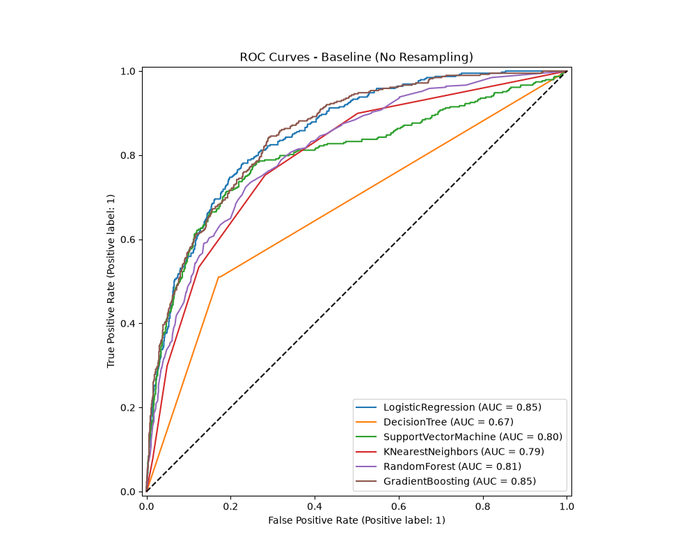
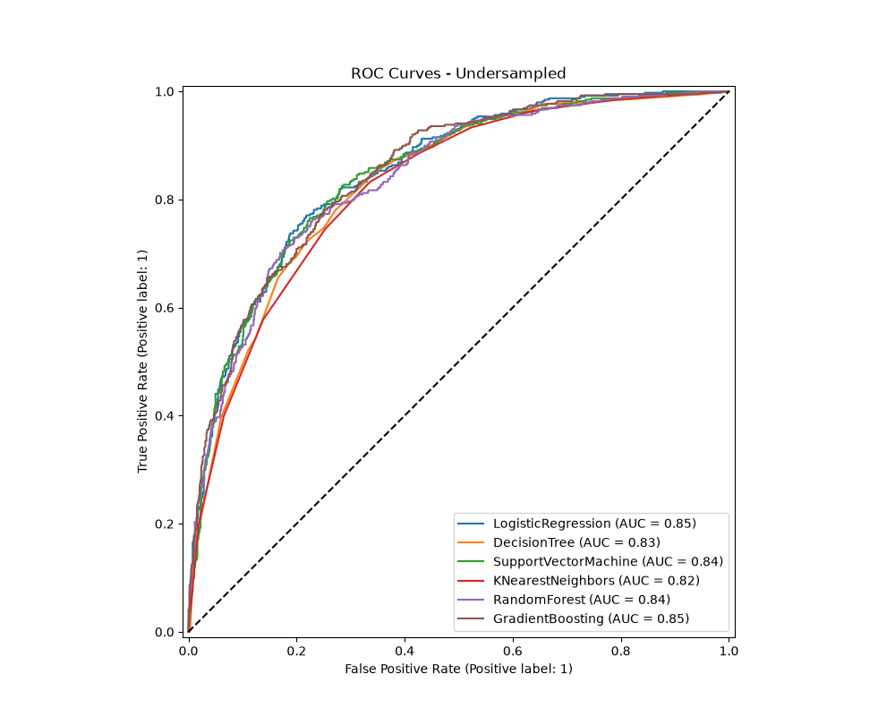
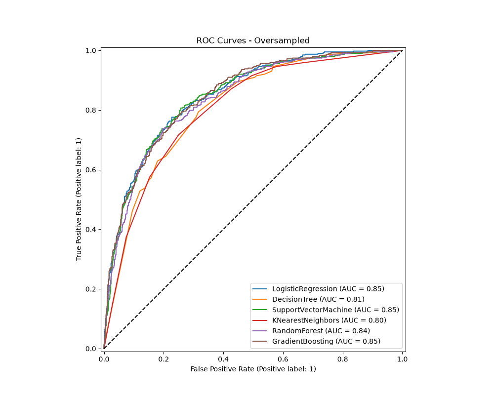

Analyzing the Telco Customer Churn dataset required standardizing 19 features, including transforming 9 categorical variables via One-Hot Encoding and scaling 3 quantitative variables. A critical early lesson was identifying hidden missing data: new customers with zero tenure had blank TotalCharges strings, which pandas misinterpreted as objects. Forcing these to numeric and filling them with zeros was essential to prevent pipeline failures and ensure distance-based models calculated weights correctly.

Initial baseline modeling without resampling revealed the danger of relying on accuracy when evaluating imbalanced data. Across all six algorithms, accuracy hovered between 78% and 81%. However, this metric was highly deceptive. Because the dataset is heavily skewed toward non-churners, the models achieved high accuracy simply by over-predicting the majority class. This resulted in severely compromised recall. For example, the baseline Random Forest identified only 47.6% of actual churners, and Gradient Boosting found just 54.8%. The models were highly precise when they did predict churn, but they failed their primary business objective: catching the majority of customers who were actually at risk of leaving.

Applying RandomUnderSampler fundamentally shifted this algorithmic behavior. By randomly discarding non-churners to equalize the classes, the models were forced to prioritize churn patterns. The impact on recall was drastic and immediate: K-Nearest Neighbors recall jumped to 83.2%, and Support Vector Machine reached 80.9%. However, this came at a severe cost to accuracy, which dropped to the 71–74% range across the board. The models became hyper-sensitive, flagging many false positives and causing precision to plummet into the 48–52% range. While undersampling successfully identified almost all churners, the aggressive loss of majority-class training data severely degraded the models' overall predictive reliability.

Using SMOTE (Synthetic Minority Over-sampling Technique) provided a much more effective balance. Rather than discarding valuable baseline data, SMOTE synthesized new, realistic minority-class examples using nearest-neighbor mathematics. This approach significantly improved recall over the baseline (Logistic Regression hit 78.3%, and Gradient Boosting reached 70.8%) while maintaining much stronger accuracy (75–79%) than undersampling. Gradient Boosting emerged as the strongest overall performer with SMOTE, achieving a 77.9% accuracy and 70.8% recall. This proved that generating synthetic data points helps tree-based ensembles map complex, non-linear class boundaries much more effectively than simply deleting rows.

Ultimately, the primary lesson learned is that algorithmic class imbalance cannot be solved by hyperparameter tuning alone. While the GridSearchCV configurations squeezed out minor F1-score optimizations, the data sampling method dictated the fundamental behavior of the model. Accuracy proved to be a misleading metric that masked poor minority-class detection. Undersampling maximizes recall but destroys precision, making it viable only if false alarms carry zero business cost. SMOTE proved vastly superior for this dataset, offering the optimal mathematical trade-off between accurately predicting the majority class and successfully catching the minority churners.

