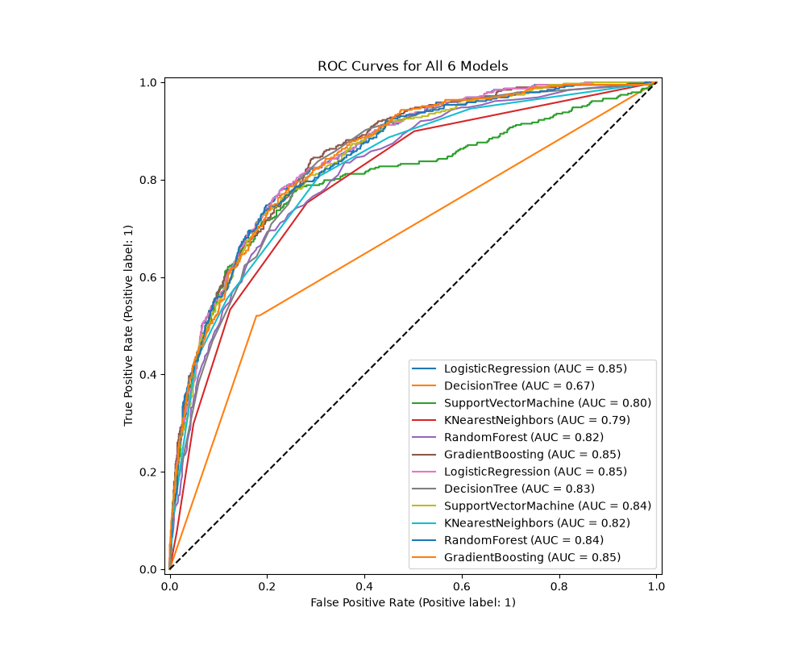

I created my data loader function in my data_loader.py file, the function reads the raw data file, initalized target as the churn column and then drops churn and customerID since CustomerId isnt a feature and churn is our target. It then intializes features as the rest of the 2D matrix.

the next step is to list my kinds of features and get a count for each. 
kinds of features: 
Categorical(nominal), 
Ordinal, 
Quantative (numbered)

here are all my features (19 in total)

-print(df.nunique()) this gave me a list which showed uniqueness which helped me classify. 
customerID          7043
gender                 2
SeniorCitizen          2
Partner                2
Dependents             2
tenure                73
PhoneService           2
MultipleLines          3
InternetService        3
OnlineSecurity         3
OnlineBackup           3
DeviceProtection       3
TechSupport            3
StreamingTV            3
StreamingMovies        3
Contract               3
PaperlessBilling       2
PaymentMethod          4
MonthlyCharges      1585
TotalCharges        6531
Churn                  2

gender: boolean
SeniorCitizen: boolean
Partner: boolean
Dependents: boolean
tenure: quantative
PhoneService: boolean  
MultipleLines: categorical
InternetService: categorical
OnlineSecurity: categorical
OnlineBackup: categorical
DeviceProtection: categorical
TechSupport: categorical
StreamingTV: categorical
StreamingMovies: categorical
Contract: categorical
PaperlessBilling: boolean
PaymentMethod: categorial
MonthlyCharges: quantative
TotalCharges: quantative

total boolean features: 6
total categorical features: 9
total quantative features: 3

upon running print(features.dtypes) to get all the data types, I can see that total charges is showing up as a string because new clients havnet had any payements yet so their total charges show up as ' ' blank which causes pandas to think its its a string object     

def load_customer_data():
    df = pd.read_csv('data/Customer-churn.csv')
    df['TotalCharges'] = pd.to_numeric(df['TotalCharges'], errors='coerce').fillna(0)
    target = df['Churn']
    features = df.drop(columns=['customerID', 'Churn'])
    print(features.dtypes)
    #print(target.value_counts())
    #print(features.shape)
    #print(target.shape)
    #print(df.nunique())
    return(features, target)

gender                  str
SeniorCitizen         int64
Partner                 str
Dependents              str
tenure                int64
PhoneService            str
MultipleLines           str
InternetService         str
OnlineSecurity          str
OnlineBackup            str
DeviceProtection        str
TechSupport             str
StreamingTV             str
StreamingMovies         str
Contract                str
PaperlessBilling        str
PaymentMethod           str
MonthlyCharges      float64
TotalCharges        float64
dtype: object

df['TotalCharges'] = pd.to_numeric(df['TotalCharges'], errors='coerce').fillna(0)

pd.to_numeric(df['TotalCharges']) changes all valid number strings to numerical values
errors='coerce' changes all blank '' values to NaN
.fillna(0) replaces all NaN values with 0 

*I could replace missing features 0 with the mean (average) of my feature set for TotalCharges ** I could ** I should? !!!

made my repository and pushed my first commit! scaffold project + step 1: data_loader

preprocessing.py:
since my data types have been worked through in my data loader, i preprocessed my data, for all numerical values I transformed them using standard scalar (standardization) which sets the mean to 0 and the standard deviation to 1 and then for all my categorical objects / strings I added OneHotEncoding to change them to binary so they can be calculated.
the point of this is to have good data to train

models.py:
I then created untrained models which is my factory. I instansiated all 6 classifcation algorithms: logistic regression, decision tree, SVM, K-NN, Random Forest, Gradient Boosting.

resampling.py:

I instantiated my undersampler - RandomUnderSampler which takes away random data and my oversampler - smote which grabs the k-nn and creates versions of it synthetic minority oversampling technique.

The precision is intuitively the ability of the classifier not to label as positive a sample
that is negative. (Out of all customers the model predicted would churn, how many actually churned? High precision means low false alarm rate.)

The recall is intuitively the ability of the classifier to find all the positive samples. (Out of all customers the model predicted would churn, how many actually churned? High precision means low false alarm rate.)

11:55pm 2026-09-27 - I've hit a roadblock, I am using ai assistance to walk through the assingment and break it down from step to step. I've reached the point where there's a lot more context to uncover before I write more code. the goal isn't to progress the assignment forwards but to uncover and learn the territory I have created. It is necessary to map my code to the theory for machine learning. If something feels like magic then I must go into the textbook and understand what is going on under the hood. Once I understand the mathematics behind it and the reasoning for its use case, the code just becomes syntax. 

I will pause and return to studying, I have paused at the evaluation portion, up to date, I have finished my data_loader, the preprocessing, the models and the resampling. All which I understand its purpose. I will write more elaborate details about the code within each file and its responsibilites. 

1. src/data_loader.py ──> Loads CSV, cleans TotalCharges, separates raw X and y.
2. src/preprocessing.py ──> Defines rules for scaling numbers and one-hot encoding text.
3. src/models.py ─────> Provides the 6 raw algorithm blueprints.
4. src/resampling.py ───> Provides RandomUnderSampler and SMOTE to fix class imbalance.
5. src/evaluation.py ──> Calculates Accuracy, Precision, Recall, and saves PNG plots.
                          │
                          ▼
                      main.py (Puts everything together & runs 5-Fold Cross-Validation)

Based on the comparison of running cross validation on each of our models. We will know which one is the best to use. 

I did my cross validation before using my pipeline, so no information has been leaked to my test sept.
I set all my NaN values to 0 which could cause trouble later on. Blindly filling it with the mean or with zero needs the right treatement depending on why its missing. It could be a singal and not noise. 

Currently im using classification metrics:
precision 
recall
ROC-AUC
Accuracy 
Log-Loss

class imabalance can give you really good accuracy because the model can just predicting the majority class alawys.

for imabalacned data sets you need, precision (how many of the predicted true were actually true), recall (how many of the actual true did it find), F1 score. for ranking problems use MAP (mean average precision) or NDCG (Normalized Discounted Cumulative Gain )

ValueError: pos_label=1 is not a valid label: It should be one of ['No' 'Yes']

fix:  y = data["Churn"].map({"Yes": 1, "No": 0})

first run no sampling 
LogisticRegression LogisticRegression() {'models__C': [0.1, 1.0, 10.0], 'models__solver': ['lbfgs', 'liblinear'], 'models__max_iter': [100, 500]}
Best Params: {'models__C': 1.0, 'models__max_iter': 100, 'models__solver': 'liblinear'}
Best score: 0.5943390236407115
DecisionTree DecisionTreeClassifier() {'models__max_depth': [None, 5, 10, 20], 'models__min_samples_split': [2, 5, 10]}
Best Params: {'models__max_depth': 5, 'models__min_samples_split': 10}
Best score: 0.5790781687090795
SupportVectorMachine SVC() {'models__C': [0.1, 1, 10], 'models__kernel': ['linear', 'rbf']}
Best Params: {'models__C': 1, 'models__kernel': 'linear'}
Best score: 0.5955303531712219
KNearestNeighbors KNeighborsClassifier() {'models__n_neighbors': [3, 5, 7, 9], 'models__weights': ['uniform', 'distance']}
Best Params: {'models__n_neighbors': 9, 'models__weights': 'uniform'}
Best score: 0.5567078867321337
RandomForest RandomForestClassifier() {'models__n_estimators': [50, 100, 200], 'models__max_depth': [None, 10, 20]}
Best Params: {'models__max_depth': 10, 'models__n_estimators': 200}
Best score: 0.5781820275891908
GradientBoosting GradientBoostingClassifier() {'models__n_estimators': [50, 100], 'models__learning_rate': [0.01, 0.1], 'models__max_depth': [3, 5]}
Best Params: {'models__learning_rate': 0.1, 'models__max_depth': 3, 'models__n_estimators': 50}
Best score: 0.5794095494469511

Baseline results:

LogisticRegression LogisticRegression()
BASELINE
precision: 0.6885245901639344
accuracy: 0.8062455642299503
recall: 0.5412371134020618
confusion matrix: 
 [[926  95]
 [178 210]]
------------------------------
DecisionTree DecisionTreeClassifier()
BASELINE
precision: 0.5326370757180157
accuracy: 0.7423704755145494
recall: 0.5257731958762887
confusion matrix: 
 [[842 179]
 [184 204]]
------------------------------
SupportVectorMachine SVC()
BASELINE
precision: 0.7153558052434457
accuracy: 0.8062455642299503
recall: 0.49226804123711343
confusion matrix: 
 [[945  76]
 [197 191]]
------------------------------
KNearestNeighbors KNeighborsClassifier()
BASELINE
precision: 0.6197604790419161
accuracy: 0.7814052519517388
recall: 0.5335051546391752
confusion matrix: 
 [[894 127]
 [181 207]]
------------------------------
RandomForest RandomForestClassifier()
BASELINE
precision: 0.6630824372759857
accuracy: 0.7892122072391767
recall: 0.47680412371134023
confusion matrix: 
 [[927  94]
 [203 185]]
------------------------------
GradientBoosting GradientBoostingClassifier()
BASELINE
precision: 0.6983606557377049
accuracy: 0.8105039034776437
recall: 0.5489690721649485
confusion matrix: 
 [[929  92]
 [175 213]]
------------------------------

full results with gridsearch, 
LogisticRegression LogisticRegression() {'models__C': [0.1, 1.0, 10.0], 'models__solver': ['lbfgs', 'liblinear'], 'models__max_iter': [100, 500]}
Best Params: {'models__C': 10.0, 'models__max_iter': 100, 'models__solver': 'liblinear'}
Best score: 0.5905978729137848
precision: 0.6905537459283387
accuracy: 0.8076650106458482
recall: 0.5463917525773195
confusion matrix: 
 [[926  95]
 [176 212]]
------------------------------
DecisionTree DecisionTreeClassifier() {'models__max_depth': [None, 5, 10, 20], 'models__min_samples_split': [2, 5, 10]}
Best Params: {'models__max_depth': 5, 'models__min_samples_split': 2}
Best score: 0.5651138311126567
precision: 0.6691176470588235
accuracy: 0.7899219304471257
recall: 0.4690721649484536
confusion matrix: 
 [[931  90]
 [206 182]]
------------------------------
SupportVectorMachine SVC() {'models__C': [0.1, 1, 10], 'models__kernel': ['linear', 'rbf']}
Best Params: {'models__C': 10, 'models__kernel': 'linear'}
Best score: 0.5913287100549514
precision: 0.6697819314641744
accuracy: 0.8019872249822569
recall: 0.5541237113402062
confusion matrix: 
 [[915 106]
 [173 215]]
------------------------------
KNearestNeighbors KNeighborsClassifier() {'models__n_neighbors': [3, 5, 7, 9], 'models__weights': ['uniform', 'distance']}
Best Params: {'models__n_neighbors': 9, 'models__weights': 'uniform'}
Best score: 0.5441608451262984
precision: 0.6409495548961425
accuracy: 0.7920511000709723
recall: 0.5567010309278351
confusion matrix: 
 [[900 121]
 [172 216]]
------------------------------
RandomForest RandomForestClassifier() {'models__n_estimators': [50, 100, 200], 'models__max_depth': [None, 10, 20]}
Best Params: {'models__max_depth': 10, 'models__n_estimators': 200}
Best score: 0.5635582370177501
precision: 0.6996587030716723
accuracy: 0.8076650106458482
recall: 0.5283505154639175
confusion matrix: 
 [[933  88]
 [183 205]]
------------------------------
GradientBoosting GradientBoostingClassifier() {'models__n_estimators': [50, 100], 'models__learning_rate': [0.01, 0.1], 'models__max_depth': [3, 5]}
Best Params: {'models__learning_rate': 0.1, 'models__max_depth': 5, 'models__n_estimators': 50}
Best score: 0.5751743180670451
precision: 0.6767676767676768
accuracy: 0.7991483321504613
recall: 0.5180412371134021
confusion matrix: 
 [[925  96]
 [187 201]]
------------------------------

Part B: 

